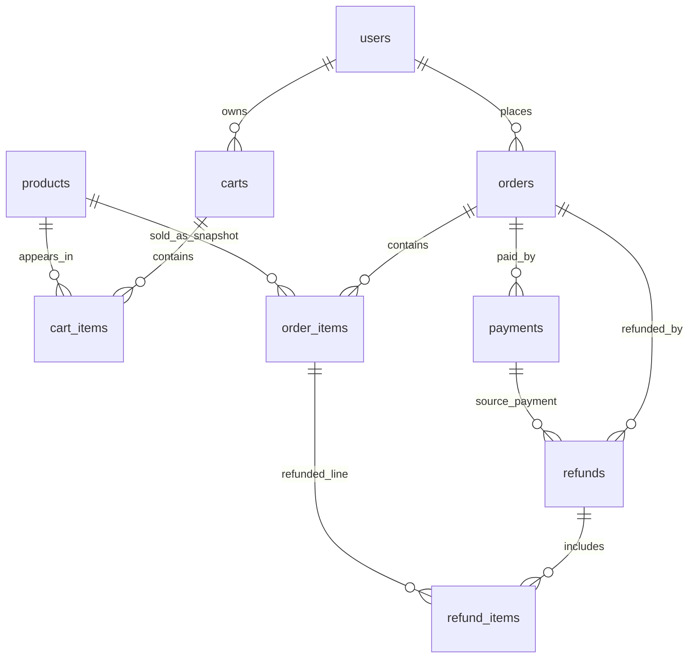
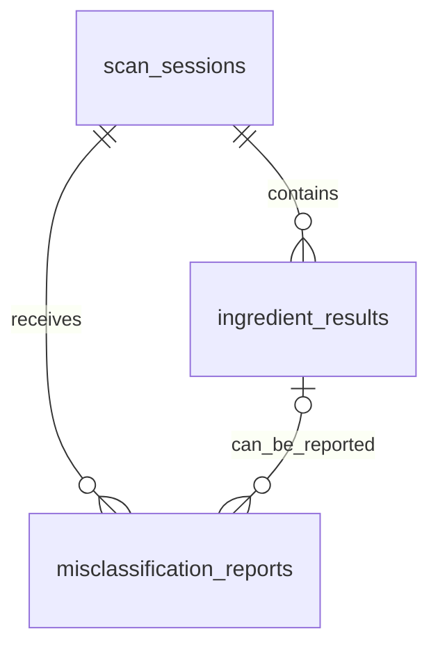

# Halal Seoul ERD v1

Last updated: 2026-03-04
Source of truth:
- `docs/sql/commerce_db_v1.sql`
- `docs/sql/scanlog_db_v1.sql`

## 1) commerce_db ERD

### commerce_db tables
- `users(user_id PK)`
- `products(product_id PK)`
- `carts(cart_id PK, user_id FK -> users.user_id)`
- `cart_items(cart_item_id PK, cart_id FK, product_id FK, UNIQUE(cart_id, product_id))`
- `orders(order_id PK, user_id FK -> users.user_id)`
- `order_items(order_item_id PK, order_id FK, product_id FK)`
- `payments(payment_id PK, order_id FK)`
- `refunds(refund_id PK, order_id FK, payment_id FK)`
- `refund_items(refund_item_id PK, refund_id FK, order_item_id FK)`

## 2) scanlog_db ERD

### scanlog_db tables
- canonical naming note:
  - business discussions may say `scan request`, but schema/API/code standardize on `scan session`
- `halal_ingredients(ingredient_id PK)`
- `scan_sessions(scan_session_id PK, user_id FK logical reference)`
- `ingredient_results(ingredient_result_id PK, scan_session_id FK -> scan_sessions.scan_session_id)`
- `misclassification_reports(report_id PK, scan_session_id FK, ingredient_result_id FK nullable, reporter_user_id FK logical reference)`

## 3) Cross-DB logical references (not FK)

Because v1 uses two logical databases on one RDS instance, the following are logical references:
- `scanlog_db.scan_sessions.user_id` -> `commerce_db.users.user_id`
- `scanlog_db.misclassification_reports.reporter_user_id` -> `commerce_db.users.user_id`
- `scanlog_db.misclassification_reports.reviewed_by` -> `commerce_db.users.user_id` (admin role expected)
- `scanlog_db.ingredient_results.normalized_text` matches classification master data in `scanlog_db.halal_ingredients.canonical_name` via service logic (not FK).

## 4) Modeling notes

- Ownership is user-based in both domains (`user_id`).
- `products.sale_status` has three states: `노출`, `중지`, `품절`.
- `order_items` stores unit price at order time (`unit_price_krw`).
- `orders.customs_clearance_number` stores personal customs clearance code when required.
- Scan image is intentionally excluded from DB by policy; only OCR/classification artifacts are persisted.
